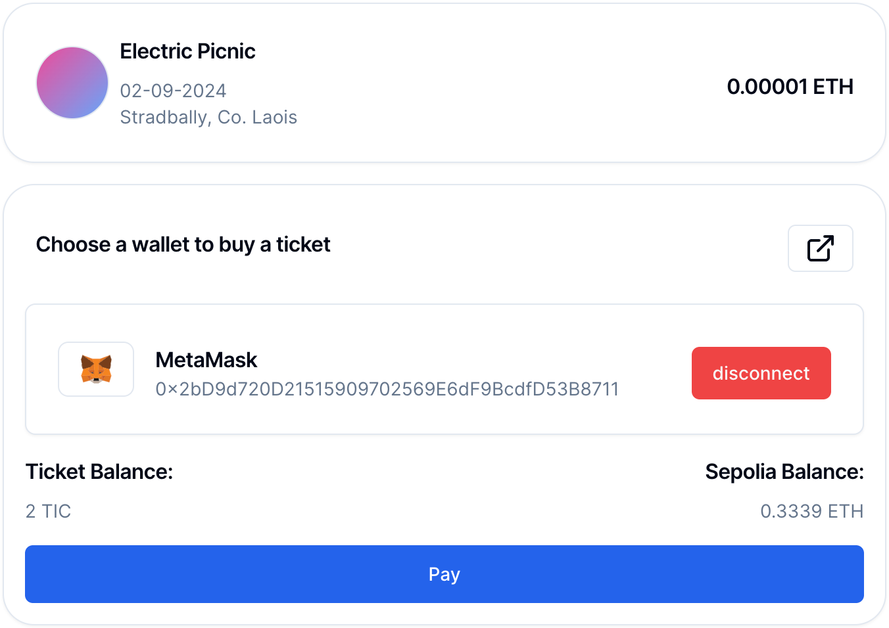

# Distributed Application (DApp) Report: Ticketing System

**Vercel Deployment:**
https://blockchain-omega.vercel.app/

## Project Overview

This project involves the creation of a Web3 Distributed Application (DApp) that implements a simple ticketing system utilizing the Ethereum Sepolia Testnet for Solidity smart contract deployments and Nextjs React for the front end.

## Table of Contents

- [Distributed Application (DApp) Report: Ticketing System](#distributed-application-dapp-report-ticketing-system)
  - [Project Overview](#project-overview)
  - [Table of Contents](#table-of-contents)
  - [Introduction](#introduction)
  - [Front End Design](#front-end-design)
    - [Wallet Creation Page](#wallet-creation-page)
    - [Balance Check Page](#balance-check-page)
    - [Ticket Purchase Page](#ticket-purchase-page)
    - [Ticket Transfer Page](#ticket-transfer-page)
  - [Blockchain Backend](#blockchain-backend)
    - [Smart Contract](#smart-contract)
    - [Deployment Details](#deployment-details)
  - [Code Overview](#code-overview)
    - [Front End Code](#front-end-code)
    - [Smart Contract Code](#smart-contract-code)
  - [Design Description](#design-description)
  - [Transaction Links](#transaction-links)
  - [Instructions to Run the Project](#instructions-to-run-the-project)
  - [Screenshots](#screenshots)

## Introduction

This project demonstrates a potential use case for blockchain technology in event management, explicitly ticketing systems. The DApp allows users to create local wallets, check their balance, purchase tickets, and transfer tickets back to the vendor. All deployed on the Sepolia Testnet.

## Front End Design

I have changed the design of the front end from the description of the project spec to one that contains a more natural flow, but it still meets all of the requirements of the project spec.

- the wallet creation is available through a dialogue box. when selecting a wallet
- the balance check page is available after selecting a wallet
- the doorman has a view where they can check other user balances and make SETH transactions.
- I chose to use [Wagmi](https://wagmi.sh/) to handle blockchain interactions; this meant I had to create a [custom connector](lib/customConnector.ts) to splice Wagmi and Web3js together. This custom connector is based on [wagmi mock connector](https://github.com/wevm/wagmi/blob/6aff9dec2f7d5b9cbb4e3889019f3e3fe5a61dde/packages/core/src/connectors/mock.ts).
  **Security Risks:**
  - The project spec forces me to use the keystore file in the web app; however, for an actual application, the user can not assume the application won't just steal their funds. It's essential only to use services like metamask, walletconnect, etc. This is because the decrypted keystore file contains the account's private key, which a malicious app could use to steal funds.

### Wallet Creation Page

- **Functionality:**
  - [x] Ability to create a wallet.
  - [x] Ability to download the created wallet.
  - [x] Display of wallet details.
- **Implementation:**
  1. Use Web3js to generate a new wallet. [code here](components/web3/new-wallet-dialog.tsx)
  2. Save the generated keystore file to local storage and offer a download link. [code here](components/web3/new-wallet-dialog.tsx)
  3. Custom connector reads the keystore file from local storage and decrypts it when needed (requires a password prompt). [code here](lib/customConnector.ts)
  4. When the wallet is selected from the radio selection, its details will be displayed along with its SETH and Ticket Balance.

### Balance Check Page

- **Functionality:**
  - [x] Allow users to check their crypto and ticket token balances.
  - [x] Different views for attendees, doorman, and venue.
- **Implementation:**
  - Users can check their balance after they select a wallet.
  - Doormans can check their balance after they select a wallet.
  - The doorman can check other users' balances by entering their address in the doorman balance check form.
  - The venue would use the same view as the doorman, which would offer the ability to check totalSupply and make SETH transactions.

### Ticket Purchase Page

- **Functionality:**
  - [x] Allow users to buy tickets (tokens) using Sepolia Ethereum (SETH).
- **Implementation:**
  - User can choose a local or external wallet (Metamask, Walletconnect, etc).
  - Once the user hits the buy button:
    - if the user is using a local wallet, they will be prompted to give their password (this is done so that wallet private keys are stored encrypted at rest in local storage).
    - If they use an external wallet, they will be prompted to approve the transaction using their wallet of choice.
  - Sign the transaction and send it to the Sepolia Testnet.
  - Wait for the transaction to be mined and display the transaction hash.
  - Display the transaction as successful or failed.

### Ticket Transfer Page

- **Functionality:**
  - [x] Allow users to transfer tickets back to the vendor.
- **Implementation:**
  - User can choose a local or external wallet (Metamask, Walletconnect, etc).
  - The user can enter the address of the doorman to transfer the ticket.
  - Users can enter the amount of tickets they want to transfer.
  - Once the user hits the transfer button:
    - if the user is using a local wallet, they will be prompted to give their password (this is done so that wallet private keys are stored encrypted at rest in local storage).
    - If they use an external wallet, they will be prompted to approve the transaction using their wallet of choice.
  - Wagmi offers a `useContract` hook that allows us to call the contract functions.
    - The `transfer` function on our erc20 contract is called with the address of the doorman as the recipient. [contract code here](contracts/src/tokens/ERC20.sol)
  - Sign the transaction and send it to the Sepolia Testnet.
  - Wait for the transaction to be mined and display the transaction hash.
  - Display the transaction as successful or failed.

## Blockchain Backend

### Smart Contract

- **Functionality:**
  - Implementing ERC-20 standard.
  - Allow tickets to be purchased using Sepolia's native cryptocurrency (SETH).
- **Implementation:**
  - Solidity contract with ERC-20 compliance.
  - Additional functions for ticket purchases and transfers.

### Deployment Details

- **Contract Address:**
  - [0xd3C95400B76394f9923C72C017b2f603dc5069A5](https://sepolia.etherscan.io/address/0xd3C95400B76394f9923C72C017b2f603dc5069A5)
- **Holding Wallets:**
  - Contract Creator: [0x2bD9d720D21515909702569E6dF9BcdfD53B8711](https://sepolia.etherscan.io/address/0x2bD9d720D21515909702569E6dF9BcdfD53B8711)
  - Ticket Purchaser: [0x64e7B67c53C441B483f76193eF6Acc23278414D4](https://sepolia.etherscan.io/address/0x64e7B67c53C441B483f76193eF6Acc23278414D4)
  - Vendor / Doorman: [0x2bD9d720D21515909702569E6dF9BcdfD53B8711](https://sepolia.etherscan.io/address/0x2bD9d720D21515909702569E6dF9BcdfD53B8711)

## Code Overview

### Front End Code

- **Web3:**
  - [x] Wallet creation logic.
    - Handled by web3js and a custom connector for Wagmi.
  - [x] Balance display logic.
    - Wagmi offers various hooks to interact with the blockchain, including `useContract` and `useBalance`.
  - [x] Ticket purchase and transfer logic.
    - Extend the standard ERC20 ABI to include custom functions for ticket purchases, `buyTicket`
- **Shadcn:**
  - Components in `/components/ui` are imported from [Shadcn UI](https://ui.shadcn.com/) (these are not components I created, This is just how Shadcn UI imports components).
    - Exceptions:
      - [Ticket](components/ui/ticket.tsx) - a custom card component to resemble a ticket (based off the [shadcn card component](components/ui/card.tsx)).

### Smart Contract Code

Boilerplate: [foundry-template](https://github.com/PaulRBerg/foundry-template)

- **Solidity:**
  - [x] ERC-20 compliant contract. [code here](contracts/src/tokens/ERC20.sol)
  - [x] Test cases for the contract. [code here](contracts/test/TicketToken.t.sol)
  - [x] Custom functions for the ticketing system.
    - A `buyTicket` function to purchase tickets at a set price (0.00001 SETH). [abi extended code](config/contracts.ts) [contract code here](contracts/src/tokens/ERC20.sol)

## Design Description

- **Architecture:**
  - Front end built with:
    - [NextJS & React](https://nextjs.org/)
    - [Shadcn UI](https://ui.shadcn.com/)
    - [Tailwind CSS](https://tailwindcss.com/)
    - [Wagmi](https://wagmi.sh/)
    - [Web3js (for keystore)](https://web3js.org/)
  - Backend using Solidity smart contracts deployed on Sepolia Testnet:
    - [Foundry](https://github.com/foundry-rs/foundry)
      - Foundry offered various tools that allowed me to quickly develop, test and deploy my smart contract to a devnet on `localhost`. This meant I could test changes without deploying to the Sepolia Testnet.
        - I implemented tests for the smart contract to ensure it was working before deploying to the Sepolia Testnet [tests here](contracts/test/TicketToken.t.sol).
      - The ERC-20 contract was based on [solmate's ERC20](https://github.com/transmissions11/solmate/blob/c892309933b25c03d32b1b0d674df7ae292ba925/src/tokens/ERC20.sol). This contract has been designed to use the minimum amount of gas possible:
        - minimizes the use of `require` statements to save gas.
        - `unchecked` has been used for arithmetic operations where an overflow can't occur.
        - avoid state changes when allowance is set to max.
- **Workflow:**
  - Users can purchase a ticket, verify their balance, or return a ticket to the doorman.
  - Ticket purchase:
    - Users can choose from a local or external wallet (Metamask, Walletconnect, etc.).
    - The user can then purchase a ticket using the buy button
  - Verify balance:
    - User can check their balance after they select a wallet.
  - Doormen have a different view where they can look up other users' balances with their addresses.
  - The doorman can also make seth transactions (send collected funds to another address, perhaps owned by the event organizer).

## Transaction Links

- **Successful Contract Deployment:**
  - [0.0.1](https://sepolia.etherscan.io/address/0xd3C95400B76394f9923C72C017b2f603dc5069A5)
- **Successful Token Purchase Execution:**
  - [Link](https://sepolia.etherscan.io/tx/0x6cf8b9d9fb9e4acd88756cc359bf6e57eacbfe81c815335d16a4aebea7e5ef82)
- **Wallet Top-Up Transactions:**
  - Contract Creator: [Link](https://sepolia.etherscan.io/tx/0x3bc234eca7e22e207e399733b84060587532b100e80d8f486e4da532d3c09dad)
  - Ticket Purchaser: [Link](https://sepolia.etherscan.io/tx/0x301bbc2888cc85846b9b323a3d80661bd1fe11d3cc09def3df2b6d58c0aaaf8d)
  - Vendor / Doorman: [Link]()

## Instructions to Run the Project

Install the dependencies:

```bash
npm install
# or
yarn install
# or
pnpm install
# or
bun install
```

First, run the development server:

```bash
npm run dev
# or
yarn dev
# or
pnpm dev
# or
bun dev
```

The dev server should be available at [http://localhost:3000](http://localhost:3000).
by default, the project will try to use the localhost devnet unless a `NEXT_PUBLIC_TICKET_TOKEN_ADDRESS` is specified in the `.env.local` file.

To use my deployed contract and for external wallets to work, please add the following to your `.env.local` file (if not already present):

```bash
NEXT_PUBLIC_TICKET_TOKEN_ADDRESS="0xd3C95400B76394f9923C72C017b2f603dc5069A5"
# needed for wagmi
NEXT_PUBLIC_WALLETCONNECT_PROJECT_ID="8fd464d7ddcfb097ed3c539bfadc0123"
```

Deploying the smart contract is a bit more involved:

1. Install the foundry CLI [guide here](https://book.getfoundry.sh/getting-started/installation)
2. set the .env file to contain the following

```bash
API_KEY_INFURA=e64e0f234c6c45a3b55011391da6fe61
PRIVATE_KEY=CONTRACT_OWNER_PRIVATE_KEY
ETHERSCAN_API_KEY=C7DR9BD5K495KVFS7GBN641M3V2MGVWHX3
SEPOLIA_RPC_URL=https://sepolia.infura.io/v3/e64e0f234c6c45a3b55011391da6fe61
```

3. Run the following commands to deploy the contract

```bash
./scripts/deploy-contract.sh
```

** Troubleshooting **

- Keep in mind the `/contract` directory has it's own readme create from the boilerplate which offers detailed instructions on how to use foundry to test and deploy to anvil.

## Screenshots

| Screenshot          | Image                                                                             |
| ------------------- | --------------------------------------------------------------------------------- |
| Buy Ticket          |                             |
| Doorman Send Crypto |  |
| Import Wallet       |                    |
| Create Wallet       |                    |
| Doorman Wallet      |                 |
| Homepage            |                                   |
| Meta Mask Example   |        |
| Validate Ticket     |              |
